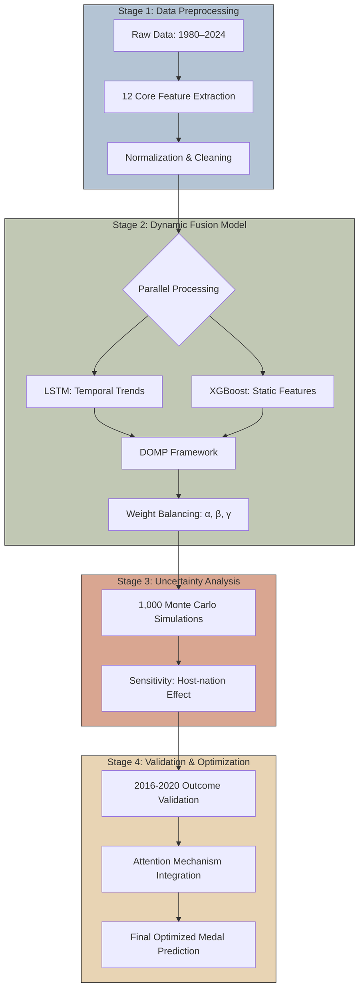

```mermaid
graph TD
    %% Global Styles
    classDef preprocessing fill:#B4C4D4,stroke:#333,stroke-width:1px;
    classDef construction fill:#C1C8B4,stroke:#333,stroke-width:1px;
    classDef uncertainty fill:#D9A691,stroke:#333,stroke-width:1px;
    classDef optimization fill:#E8D4B4,stroke:#333,stroke-width:1px;

    subgraph Stage1 [Stage 1: Data Preprocessing]
        A[Raw Data: 1980–2024] --> B[12 Core Feature Extraction]
        B --> C[Normalization & Cleaning]
    end

    subgraph Stage2 [Stage 2: Dynamic Fusion Model]
        C --> D{Parallel Processing}
        D --> E[LSTM: Temporal Trends]
        D --> F[XGBoost: Static Features]
        E & F --> G[DOMP Framework]
        G --> H[Weight Balancing: α, β, γ]
    end

    subgraph Stage3 [Stage 3: Uncertainty Analysis]
        H --> I[1,000 Monte Carlo Simulations]
        I --> J[Sensitivity: Host-nation Effect]
    end

    subgraph Stage4 [Stage 4: Validation & Optimization]
        J --> K[2016-2020 Outcome Validation]
        K --> L[Attention Mechanism Integration]
        L --> M[Final Optimized Medal Prediction]
    end

    class Stage1 preprocessing;
    class Stage2 construction;
    class Stage3 uncertainty;
    class Stage4 optimization;
```